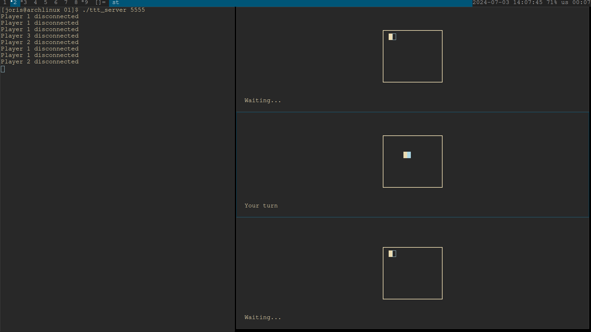
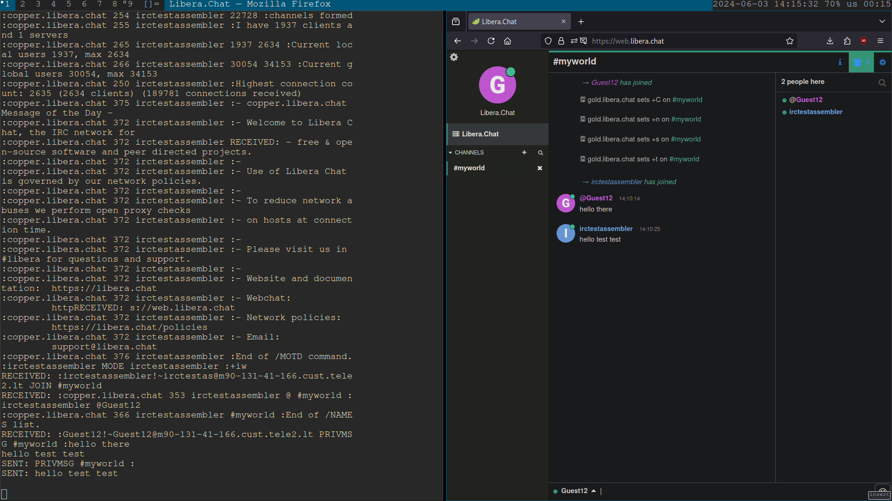

**Three-Player Tic-Tac-Toe with Sockets in C**

My first networking project was a computer networks assignment where I built a three-player Tic-Tac-Toe game. I wrote a protocol, server, and client in C to make it all work over sockets.

**IRC Client in x64 Assembly**

After getting into CTF competitions, I wanted to get better at assembly, so I took a uni networking assignment and wrote an IRC client in x64 assembly. It was tough but really helped me learn more about reverse engineering and low-level programming.

